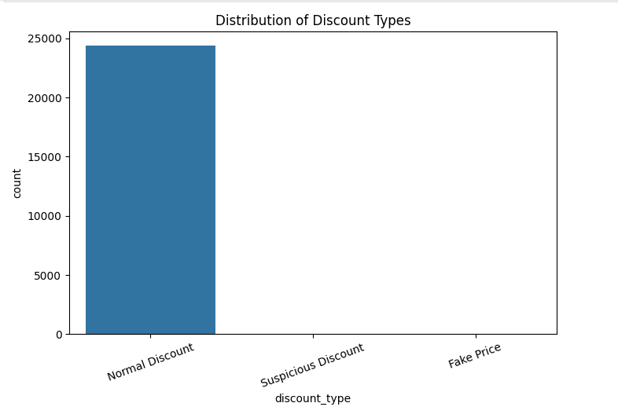
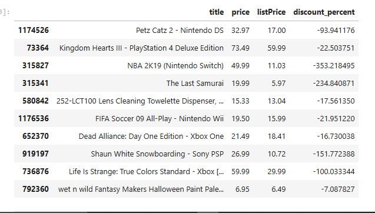
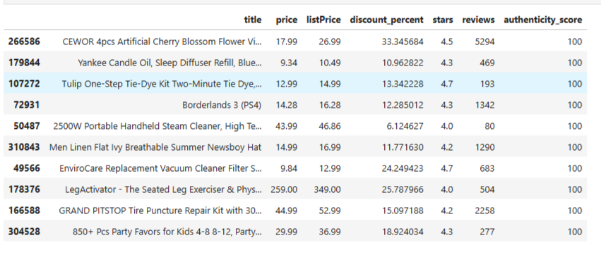

# 🛒 Fake Discount Detector

A data analytics project that detects whether online shopping discounts are genuine or manipulated.

---

## The Problem

E-commerce platforms often increase the MRP before sales and then show huge discounts.
Customers believe they are saving money — but many deals are fake.

---

## The Solution

This project analyzes real Amazon product pricing data and calculates a **Deal Authenticity Score (0–100)** using:

* Discount percentage anomalies
* Price vs original MRP validation
* Product rating reliability
* Review count trust factor

---

## Example — Discount Distribution

---

## Fake Deals Detected

---

## Best Genuine Deals

---

## Key Features

* Detect fake pricing (price > MRP)
* Identify suspicious discounts (>80%)
* Rank trustworthy deals using scoring algorithm
* Reveal scam-like listings automatically

---

## Tech Stack

Python • Pandas • NumPy • Matplotlib • Seaborn • Git

---

## Future Improvements

* Machine learning classification
* Brand trust ranking
* Price history tracking
* Interactive dashboard
