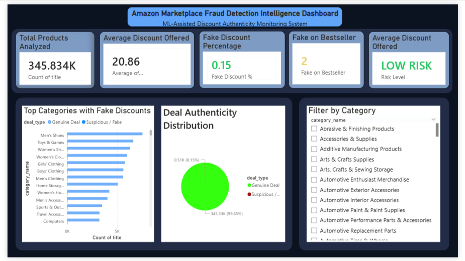

# Amazon Fake Discount Detection System

End‑to‑end Machine Learning + Analytics project that detects suspicious pricing on e‑commerce products and visualizes risk patterns through an interactive Power BI dashboard.

---

## Project Overview

Online marketplaces often show inflated MRPs to create the illusion of large discounts. This project builds a **rule‑assisted ML fraud detection system** to identify such fake discounts and present insights through a professional analytics dashboard.

The system:

1. Cleans and analyzes 1.4M Amazon product listings
2. Engineers fraud indicators from pricing behaviour
3. Trains a classification model to detect suspicious deals
4. Saves a deployable model (.pkl)
5. Serves predictions via a Python app
6. Visualizes results in a Power BI business dashboard

---

## Key Features

### Machine Learning

* Fake discount detection model
* Handles highly imbalanced fraud data
* Feature importance analysis
* Deployable model (.pkl)

### Analytics

* Discount distribution analysis
* Category‑wise fraud patterns
* Bestseller fraud tracking
* Risk scoring system

### Dashboard (Power BI)

* KPI cards (Total products, Avg discount, Fake rate)
* Deal authenticity distribution
* Top categories with fake discounts
* Category filter slicer
* Dynamic risk level indicator

### Deployment Ready

* Trained model saved
* Predictive app (app.py)
* Clean structured repository

---

## Dataset

Source: Amazon Products Dataset (Kaggle)

Used tables:

* `amazon_products` – product pricing & reviews
* `amazon_categories` – category mapping

Key columns used:

* price
* listPrice (MRP)
* stars
* reviews
* boughtInLastMonth
* category_id

---

## Fraud Logic

A product is considered suspicious when:

* Price > MRP (negative discount)
* Extremely high discount (>80%)
* Abnormal price behaviour relative to rating & reviews

The ML model learns patterns beyond simple rule detection.

---

## Machine Learning Pipeline

1. Data Cleaning
2. Feature Engineering
3. Label Creation (rule assisted)
4. Train/Test Split
5. Model Training
6. Evaluation (Precision/Recall focused)
7. Save Model

Model Output:

```
fake_discount_model.pkl
```

---

## Dashboard Metrics

| Metric                   | Description                     |
| ------------------------ | ------------------------------- |
| Total Products Analyzed  | Dataset coverage                |
| Average Discount Offered | Market discount behaviour       |
| Fake Discount %          | Fraud rate                      |
| Fake on Bestseller       | High‑risk manipulation          |
| Risk Level               | Overall marketplace trust score |

Risk Levels:

* LOW RISK
* MEDIUM RISK
* HIGH RISK

---

## Running the Project

### 1. Install dependencies

```
pip install -r requirements.txt
```

### 2. Run notebook

```
notebooks/analysis.ipynb
```

### 3. Launch prediction app

```
python dashboard/app.py
```

### 4. Open dashboard

Open:

```
dashboard/fake_discount_dashboard.pbix
```

Refresh data if needed.

---

## Project Structure

```
fake-discount-detector/
│
├── data/ (ignored)
├── notebooks/
│   └── analysis.ipynb
│
├── dashboard/
│   ├── fake_discount_dashboard.pbix
│   ├── powerbi_data.csv
│   ├── fake_discount_model.pkl
│   └── app.py
│
├── src/ (future API)
├── requirements.txt
├── README.md
└── .gitignore
```

---

## Skills Demonstrated

* Data Cleaning & Feature Engineering
* Imbalanced Classification
* Model Evaluation
* Model Serialization
* Business Intelligence (Power BI)
* Data Storytelling
* End‑to‑End ML Workflow

---

## Future Improvements

* Real‑time API prediction service
* Web dashboard deployment (Streamlit)
* Time‑series price tracking
* Seller fraud scoring

---

## Author

Akshat Porwal

Data Analyst / ML Enthusiast

---

This project demonstrates a complete analytics + ML pipeline suitable for fraud detection use‑cases in e‑commerce marketplaces.

---

## 📊 Power BI Dashboard Preview

> Place your screenshot inside `assets/powerbi_dashboard.png`



This dashboard provides business‑level insights including:

* Fake vs Genuine deal distribution
* Top categories with suspicious discounts
* Average discount analysis
* Bestseller manipulation detection
* Risk level indicator (Low / Medium / High)

---

## 🌐 Web App (Model Inference UI)

> Place your screenshot inside `assets/app_dashboard.png`


The web interface allows users to:

* Enter product details
* Predict whether a discount is fake or genuine
* Instantly view risk classification
* Simulate real e‑commerce fraud detection


assets/
 ├── powerbi_dashboard.png
```

GitHub automatically renders them in README.
